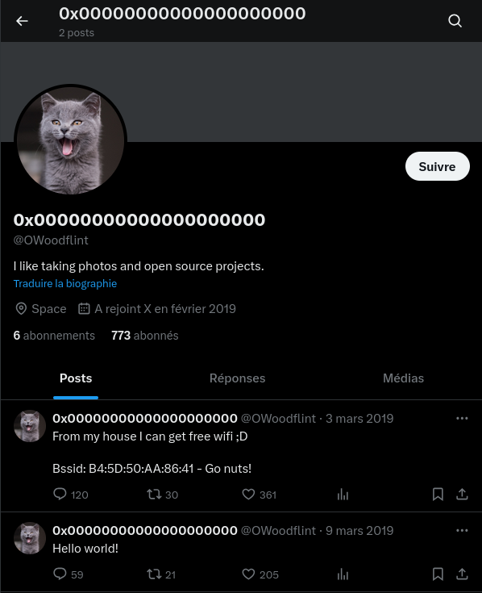
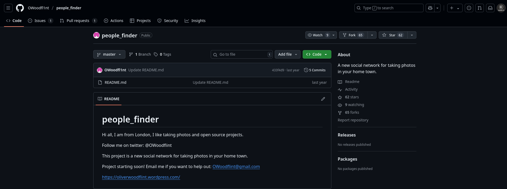
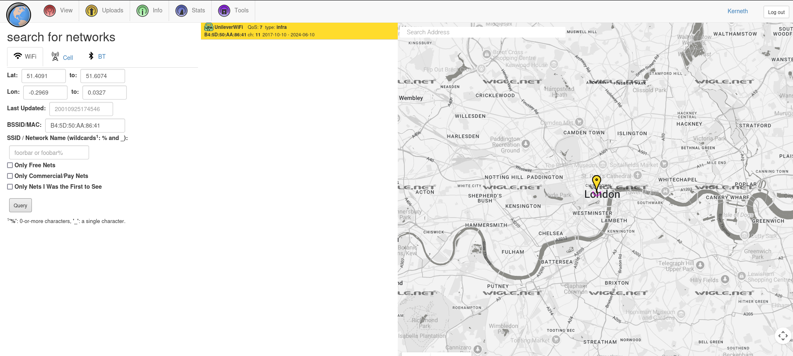
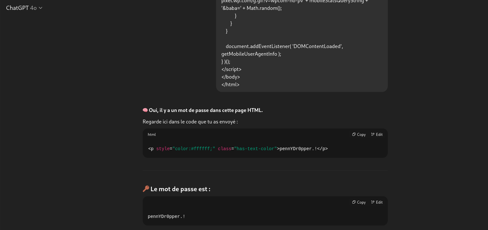

# 🕵️‍♀️ OSINT Case Report — *"OhSINT"* Challenge

**Platform:** TryHackMe
**Analyst:** Kerneth
**Date:** 25/07/2025
**Status:** ✅ Completed
**Objective:** Perform an Open Source Intelligence investigation to extract personal and technical information about a digital persona named `OWoodflint`.

---

## 🧠 Methodology

The investigation leveraged passive reconnaissance techniques using publicly available information across multiple platforms. Tools included:

* `exiftool` (metadata extraction)
* GitHub OSINT enumeration
* Twitter profile analysis
* Wigle.net for Wi-Fi geolocation
* HTML source code analysis
* Cross-referencing across WordPress, GitHub, and social media platforms

---

## 🔍 Findings

### Question 1 – **What is this user's avatar of?**

* **Approach:**
  Used `exiftool` on a provided image file to extract embedded metadata.
* **Observation:**
  The field `Copyright` contained the name `OWoodflint`.
* **Action:**
  Searched the alias on social media platforms.
* **Result:**
  Found the Twitter account associated with the alias. The profile avatar depicts a **cat**.



> ✅ **Answer:** `cat`

---

### Question 2 – **What city is this person in?**

* **Approach:**
  Continued the investigation on GitHub using the alias `OWoodflint`.
* **Observation:**
  The GitHub profile explicitly lists the user's location.
* **Result:**
  The location field indicates **London**.




> ✅ **Answer:** `London`

---

### Question 3 – **What is the SSID of the WAP he connected to?**

* **Clue found on Twitter:**
  `"BSSID: B4:5D:50:AA:86:41 – Go nuts!"`
* **Approach:**
  Queried the BSSID on [wigle.net](https://wigle.net), a global wireless network mapping platform.
* **Result:**
  The BSSID resolves to a Wi-Fi access point with SSID: **UnileverWiFi**.



> ✅ **Answer:** `UnileverWiFi`

---

### Question 4 – **What is his personal email address?**

* **Approach:**
  Reviewed the GitHub profile for contact details.
* **Result:**
  Found the email address: **[owoodflint@gmail.com](mailto:owoodflint@gmail.com)**


> ✅ **Answer:** `owoodflint@gmail.com`

---

### Question 5 – **What site did you find his email address on?**

* **Approach:**
  Traced the source of the email discovery.
* **Result:**
  It was publicly visible on the user’s **GitHub** profile.

> ✅ **Answer:** `GitHub`

---

### Question 6 – **Where has he gone on holiday?**

* **Approach:**
  Located a link to a personal WordPress blog on GitHub.
* **Action:**
  Navigated to the blog and read the first post titled “Hey”.
* **Observation:**
  The post says: *“I'm in New York right now, so I will update this site right away with new photos!”*


> ✅ **Answer:** `New York`

---

### Question 7 – **What is the person's password?**

* **Approach:**
  Performed source code inspection of the blog's HTML by chatgpt.
* **Observation:**
  Found hidden text embedded in a `<p>` tag styled with `color: #ffffff`, rendering it invisible to the naked eye.
* **Content Extracted:**

  ```html
  <p style="color:#ffffff;" class="has-text-color">pennYDr0pper.!</p>
  ```



> ✅ **Answer:** `pennYDr0pper.!`

---

## 🛠️ Tools Used

* [`exiftool`](https://exiftool.org/)
* [Twitter](https://x.com/owoodflint?lang=fr/)
* [GitHub](https://github.com/OWoodfl1nt/people_finder/)
* [Wigle.net](https://wigle.net/)
* [WordPress](https://oliverwoodflint.wordpress.com/)
* Chatgpt

---

## 🧩 Skills Demonstrated

* Metadata extraction and interpretation
* Username correlation across platforms
* Wi-Fi geolocation and SSID resolution via BSSID
* Email enumeration from public developer profiles
* Identification of hidden HTML elements in website source
* Logical deduction through multi-source correlation

---

## 🛡️ Analyst's Note

This challenge demonstrates how public digital footprints — even minimal — can be cross-referenced to reconstruct an individual's identity, location, habits, and even credentials. It reinforces the importance of operational security (OPSEC) 
in public platforms, particularly for developers and content creators.
