# 🕵️‍♀️ OSINT Case Report — *"Missing in Action"* Challenge

**Platform:** Hack The Box  
**Analyst:** Kerneth  
**Date:** 07/08/2025  
**Status:** ✅ Completed  

## 🎯 Objective

The goal of this investigation is to gather open-source intelligence (OSINT) in order to determine the whereabouts of Roland Sanchez,  
a missing person from Birmingham, UK, who disappeared during a business trip. His family suspects he may have been kidnapped.  
The objective is to uncover any relevant information that could help understand his last known activities, online presence, and potential leads regarding his disappearance.

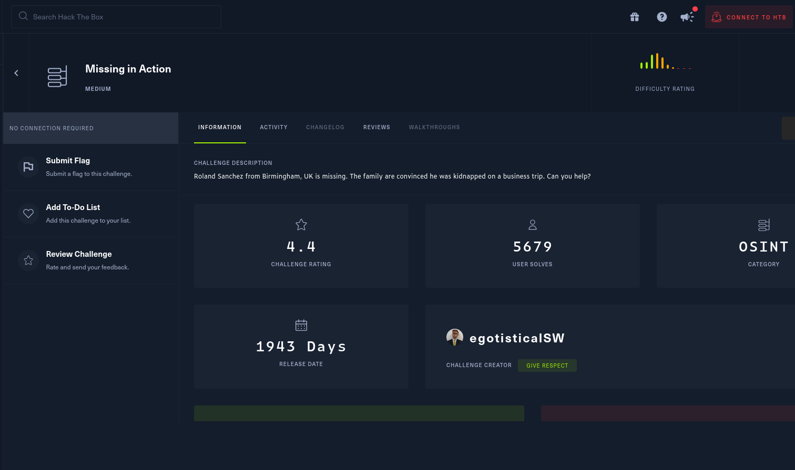

---

## 🧠 Methodology

The investigation leveraged passive reconnaissance techniques using publicly available information across multiple platforms. Tools included:

- Twitter profile analysis  
- Google Dorking  
- LinkedIn profile analysis  
- Cross-referencing across Wix, Twitter, and LinkedIn  

---

## 🔍 Findings

### 🔎 Clue 1 – Roland Sanchez's LinkedIn Profile

**Approach:**  
Performed a web search using Roland Sanchez's full name and his city to identify any professional or social media presence.

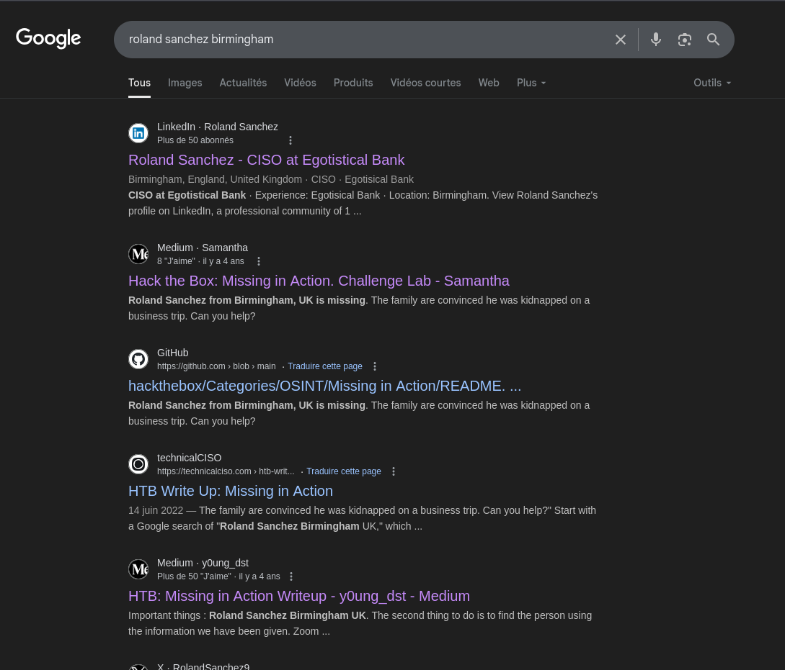

**Observation:**  
A LinkedIn profile matching his name and location was found.

**Action:**  
Examined the profile for relevant professional information.

**Result:**  
Identified his current employer: **EgotisticalBank**.

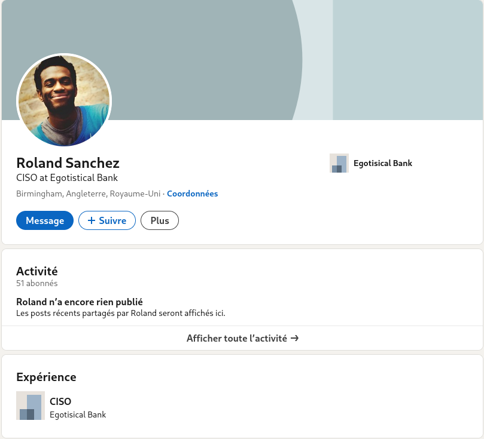

---

### 🔎 Clue 2 – EgotisticalBank's Wix Website

**Approach:**  
Continued the investigation by analyzing the official Wix website of EgotisticalBank.

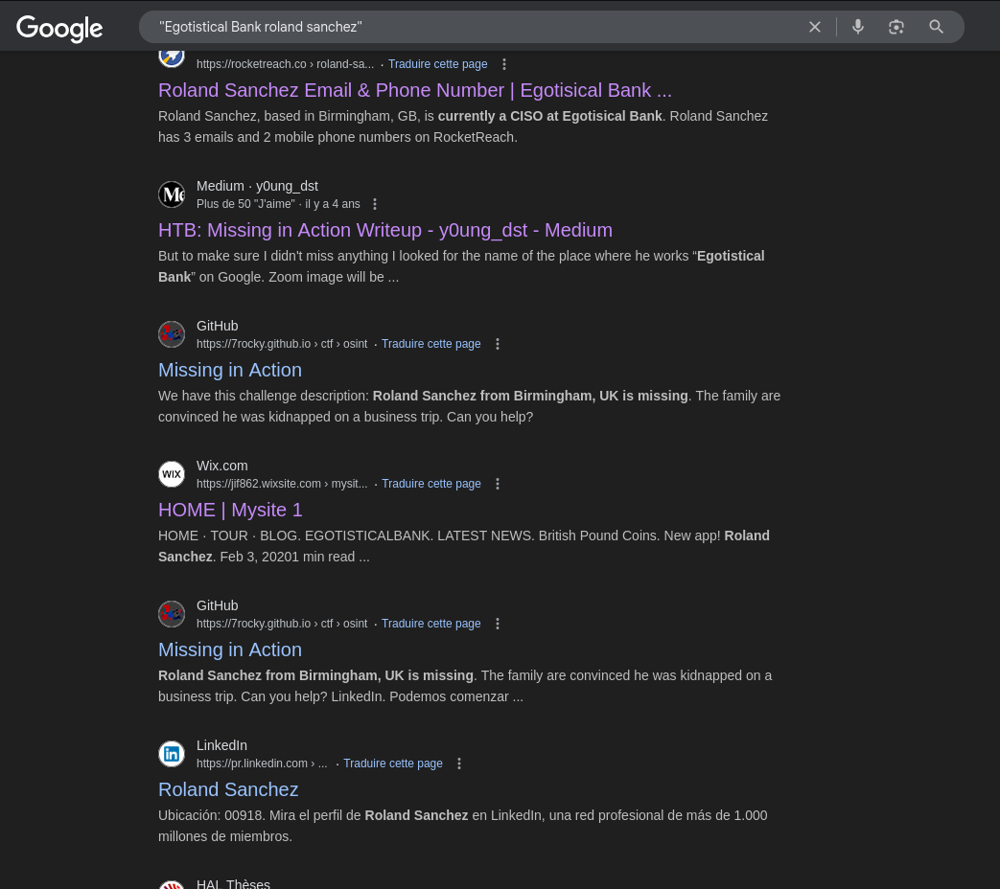

**Observation:**  
In the blog post titled *"On holiday"*, Roland writes:

> "Should I get Twitter to post holiday pics??"  
> "Whilst on my travels I'll be sure to review the best hangouts I find – I'm a sucker for a good cup of java (not the programming language :D)"

These comments suggest he might have shared updates during his trip on Twitter, possibly using a review-related account.

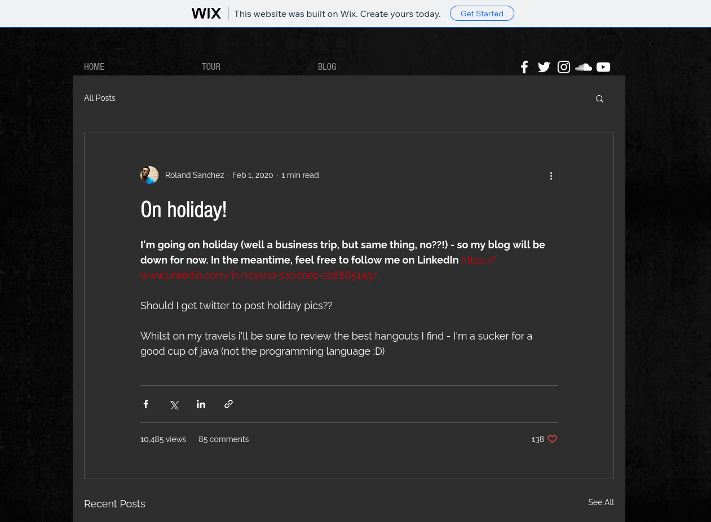

**Action:**  
Searched for "Roland Sanchez" on Twitter, but no relevant results were found.  
Switched focus to the official Twitter account of EgotisticalBank, and found a promising lead.

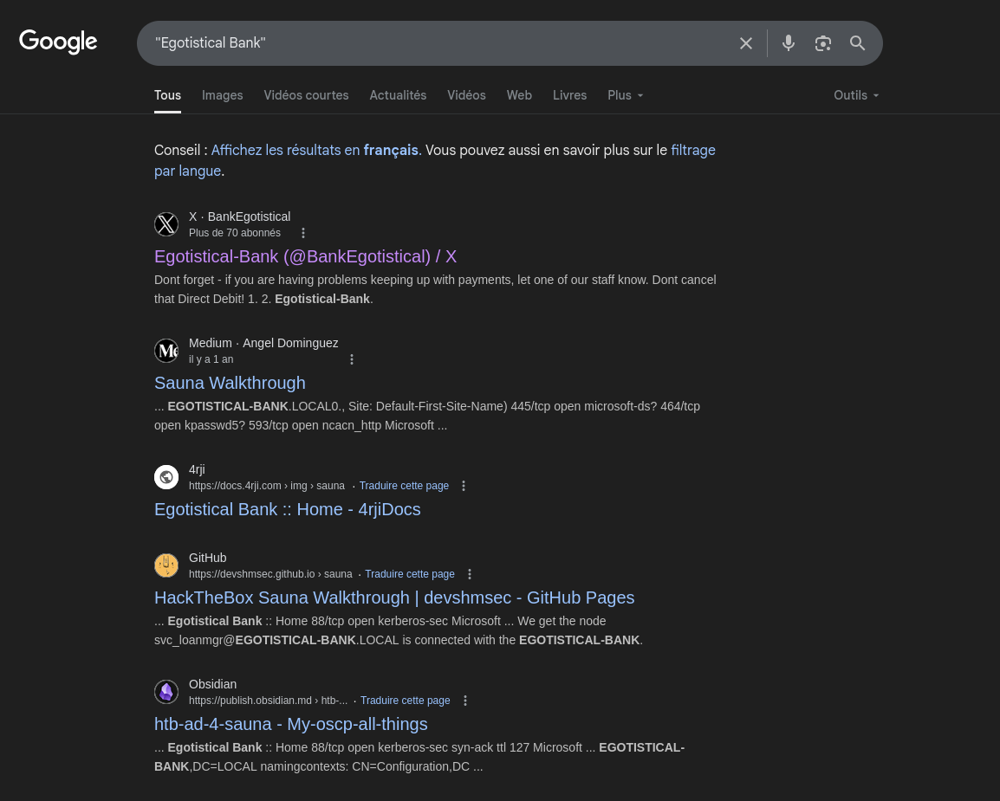

**Result:**  
On their Twitter feed, EgotisticalBank mentions **@FoursquareGuide**, which appears to be a travel or city review account — possibly linked to Roland’s trip.

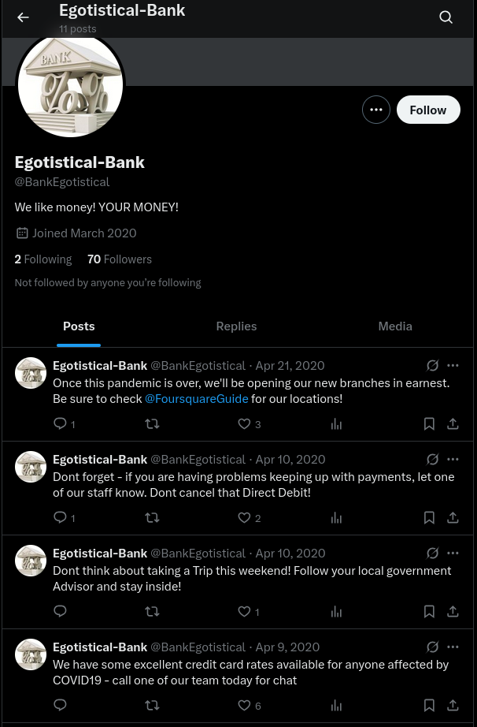

---

### 🔎 Clue 3 – Finding the Answer on FoursquareGuide

**Approach:**  
Performed a Google Dork targeting `site:foursquare.com "Roland Sanchez"` to identify any posts or reviews authored by Roland.

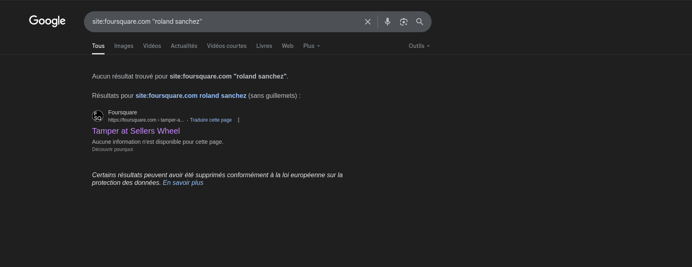

**Observation:**  
Found a direct match linking to a user profile on FoursquareGuide.

**Result:**  
Roland had indeed posted a message on the platform — containing the **flag** we were searching for.

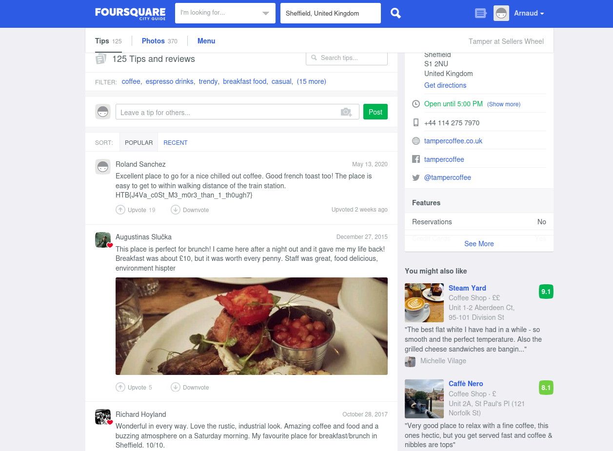

### 🐇 Misleads & Rabbit Holes

**1. False Twitter Match – Wrong Roland Sanchez**  
During the initial phase of the investigation, I found a Twitter account belonging to a user named *Roland Sanchez*. At first glance, it seemed relevant, but after analyzing the profile, it became clear that the account had been inactive since **2013**.  
Given that the business trip in question refers to "**2020 UK TOUR DATES**", this profile was excluded as irrelevant.

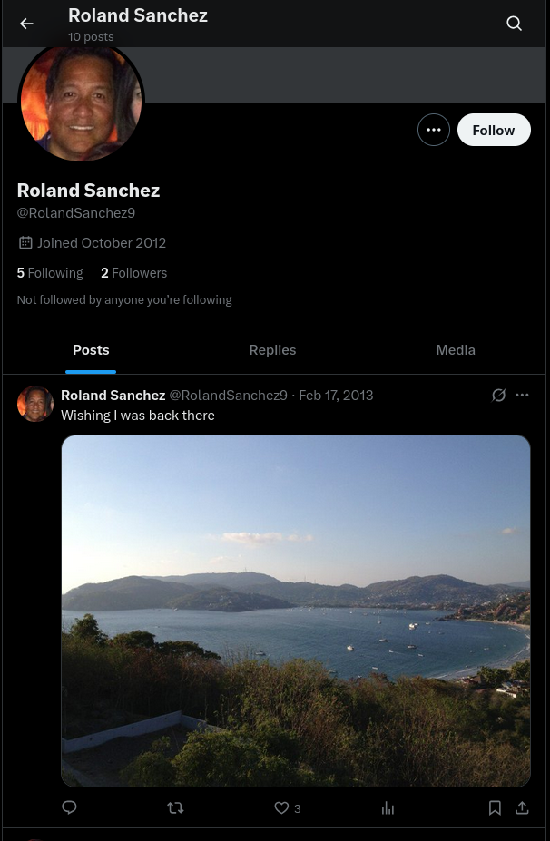

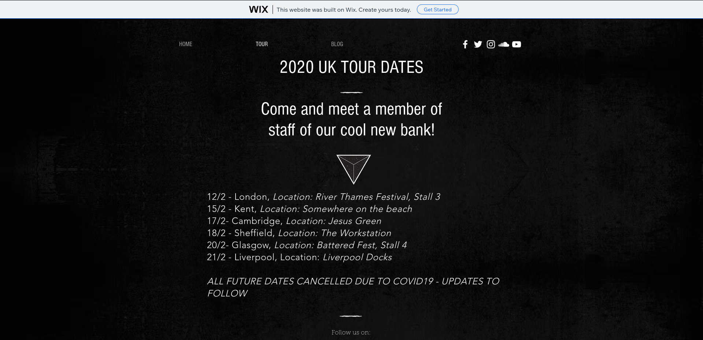

**2. Reverse Image Search on LinkedIn Profile Picture**  
I attempted to verify the authenticity of Roland Sanchez's LinkedIn profile picture using **Yandex reverse image search**. The search revealed that the photo is likely a **royalty-free stock image**, which suggests that the individual is **fictional** and was created specifically for the purpose of the OSINT challenge.

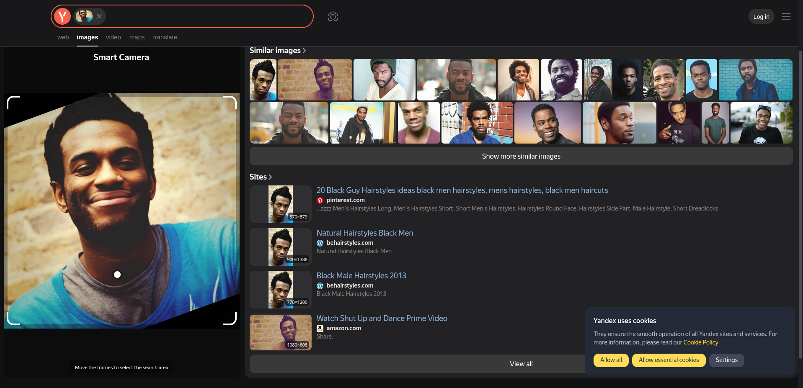

---

## 🛠️ Tools Used

* [Foursquare](https://app.foursquare.com/v/tamper-at-sellers-wheel/51f9fe67498e9ffe9ce6fd14/)
* [Twitter](https://x.com/BankEgotistical/)
* [LinkedIn](https://www.linkedin.com/in/roland-sanchez-1b88651a5/?originalSubdomain=uk/)
* [Wix](https://jif862.wixsite.com/mysite-1/)
* Google Dorking
* Chatgpt (for assistance and structuring)

---

## 🧩 Skills Demonstrated

* Open-Source Intelligence (OSINT): Collection and correlation of publicly available data
* Search Engine Mastery: Use of advanced Google operators for precision targeting
* Social Media Profiling: Identification and linkage of personal and professional accounts
* Pattern Recognition: Following behavioral and linguistic clues across platforms
* Analytical Thinking: Drawing conclusions from fragmented information to locate the final clue

---

## 🛡️ Analyst's Note

This investigation demonstrates how seemingly trivial online posts — such as travel plans or casual jokes — can lead to critical information when correlated across platforms. 
It also underlines the power of OSINT in reconstructing a digital footprint without direct access to private data. By tracing Roland Sanchez’s online presence, 
we were able to locate a key post confirming his whereabouts and solve the challenge.
