🕵️‍♀️ **OSINT Case Report — Orkla: Dragon Con Detective**
**Platform:** Kase Scenarios
**Agency:** Private Intelligence Assessment for Orkla
**Analyst:** Kerneth
**Date:** 07/08/2025
**Mission Status:** ✅ Successfully Completed

---

### 🎯 Mission Objective

This investigation was conducted as part of an evaluation process by Orkla, a private intelligence-led organization. The analyst was tasked with solving a series of puzzles to **prove real-world investigative abilities** using only open-source intelligence techniques. The purpose was not only to find the correct answers, but to **demonstrate logical reasoning, technical OSINT skills, and adaptability in the field**.

---

### 🧠 Methodology

The investigation was approached using the following process:

* Geolocation and mapping analysis
* Use of real-time databases (e.g., Coca-Cola locator, race result archives)
* Audio clue decoding
* Landmark identification using street views
* Cross-referencing behavioral indicators (event locations, cosplay context)
* Verification using official or semi-official public resources

Screenshots were taken throughout the investigation to document each deduction step and validate findings.

---

## 🔍 Investigation & Findings

---

### 🔎 Mission #1 – Freestyle Machines

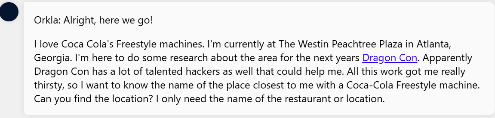

**Step 1: Location Identification**
The starting point is **The Westin Peachtree Plaza**, a well-known hotel in downtown Atlanta.

**Step 2: Understanding the Technology**
A Freestyle machine is a touchscreen soda dispenser that allows customized drinks.
I searched “Coca-Cola Freestyle Machine” and found an official locator tool:

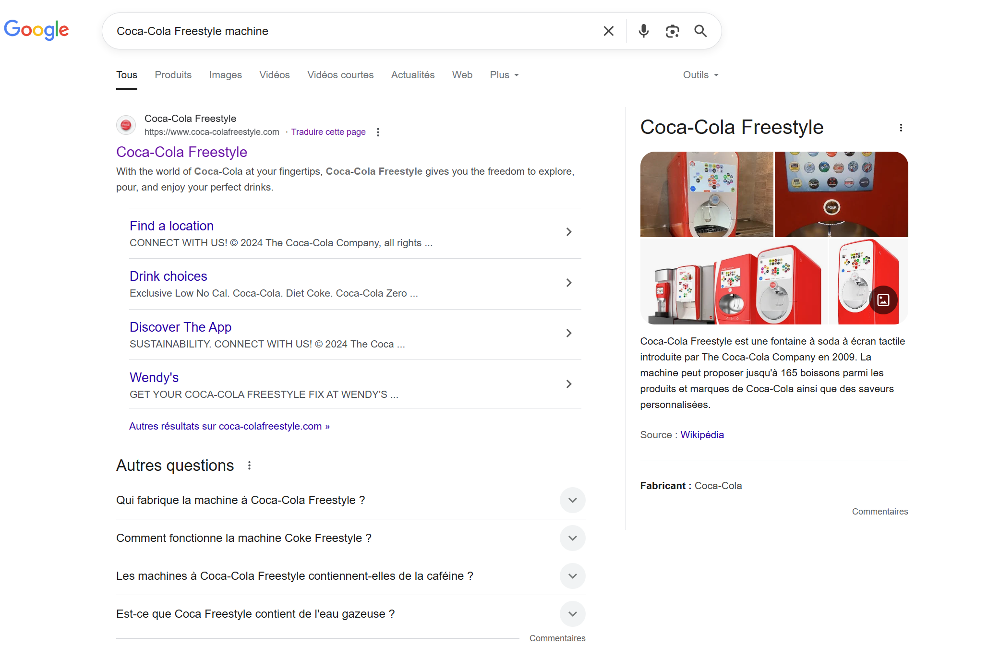

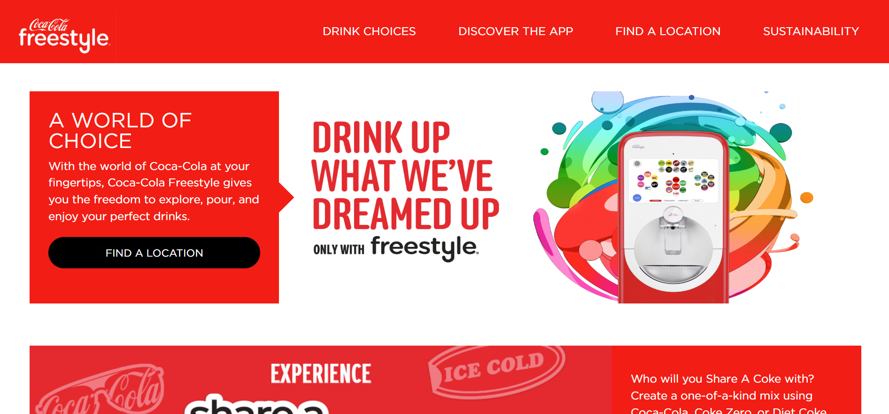

**[https://www.coca-colafreestyle.com/](https://www.coca-colafreestyle.com/)**

**Step 3: Locating Nearby Machines**
After inputting the hotel’s address into the locator, it returned nearby locations.
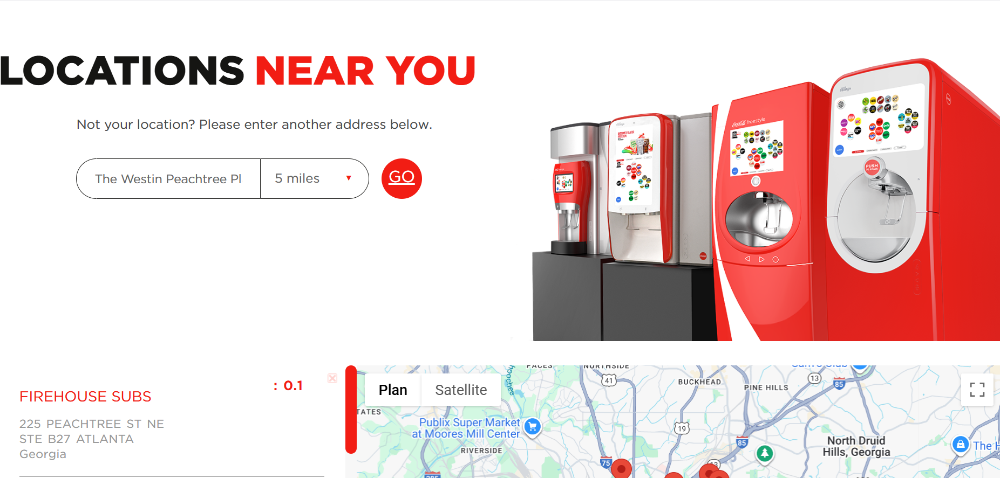

✅ **Answer:** *Firehouse Subs*

---

### 🔎 Mission #2 – Audio Puzzle with 3 Words

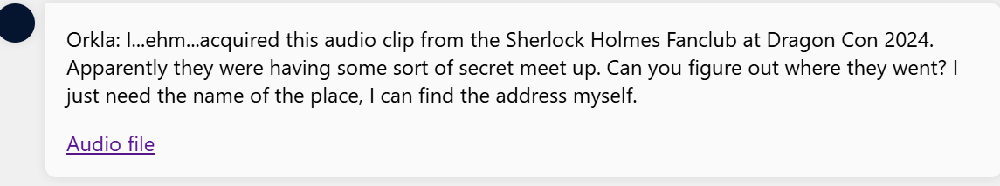

In this audio we can hear : All right, y'all. This year, we're doing our member-only meetup at Outgoing Bongo Skip. That's Outgoing Bongo Skip. See you there!

**Step 1: Identifying Pattern**
The combination of 3 distinct words with no obvious context pointed to **what3words**, a global geolocation system assigning 3-word codes to 3x3m squares.
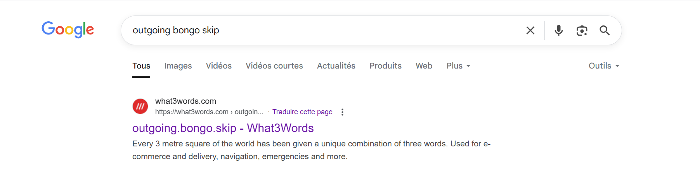

**Step 2: Decoding the Clue**
I input “outgoing.bongo.skip” into what3words, which gave me an exact location — **Trader Vic's**, a well-known restaurant in Atlanta.
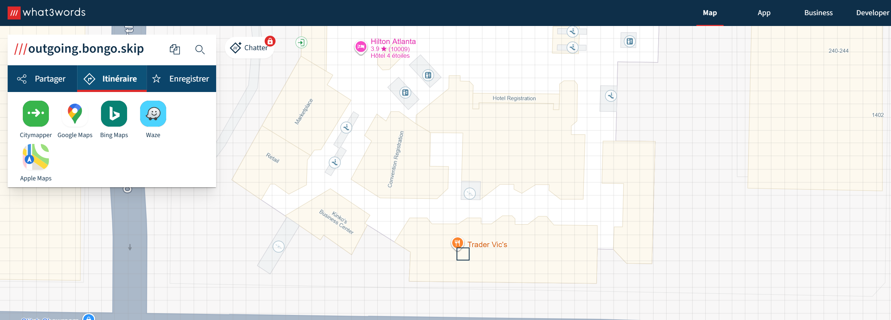

✅ **Answer:** *Trader Vic's*

---

### 🔎 Mission #3 – The Statue

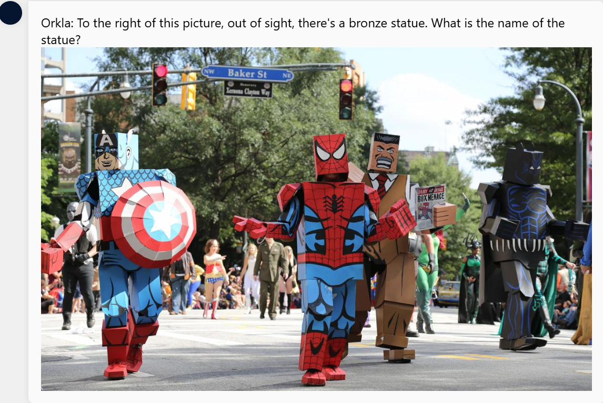

**Step 1: Environmental Clues**
From the image, I noticed:

* Cosplayers: Likely linked to **Dragon Con**, a famous event in Atlanta.
* Street signs: **Baker St** and **Xernona Clayton Way**
* A red light and general urban setup (tree line, multi-lane street, etc.)

**Step 2: Dragon Con Location Mapping**
After some research by chat-gpt, Dragon Con is hosted across multiple downtown hotels:

* Hyatt Regency
* Marriott Marquis
* Hilton Atlanta
* Sheraton Atlanta
* Westin Peachtree Plaza

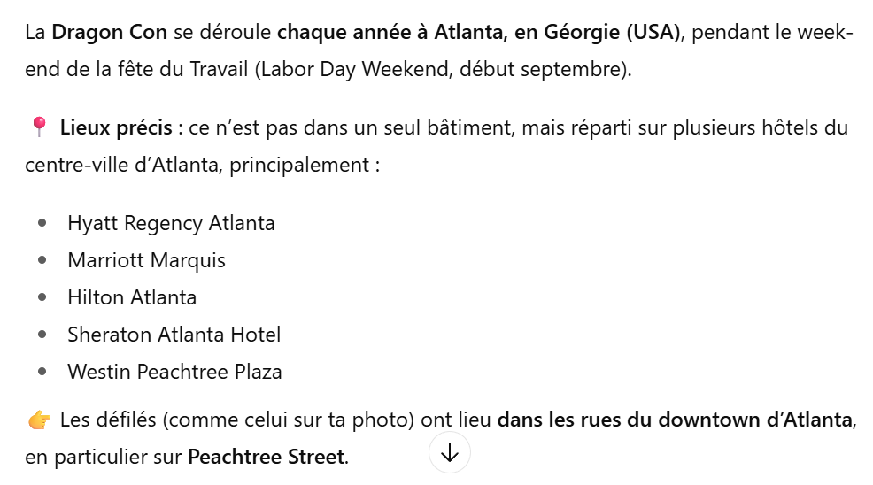

I created a **custom route in Google Maps** connecting these hotels, focusing on intersections near Baker Street.

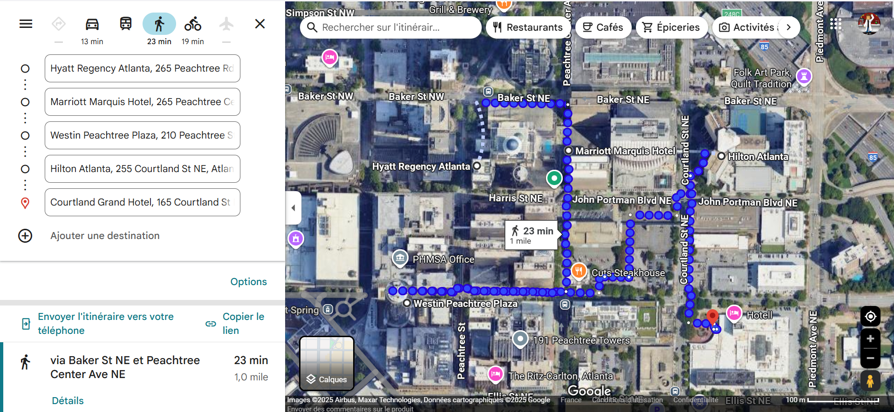

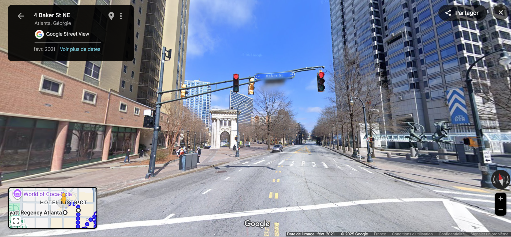

**Step 3: Verifying the Statue**
Using Google Street View and zooming into the intersection, I located a **bronze statue**, though its name was not directly visible.

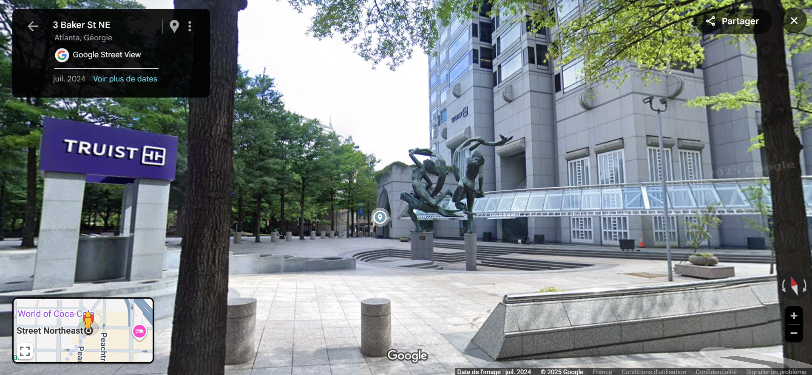

Research into the building and statue confirmed its name and creator.

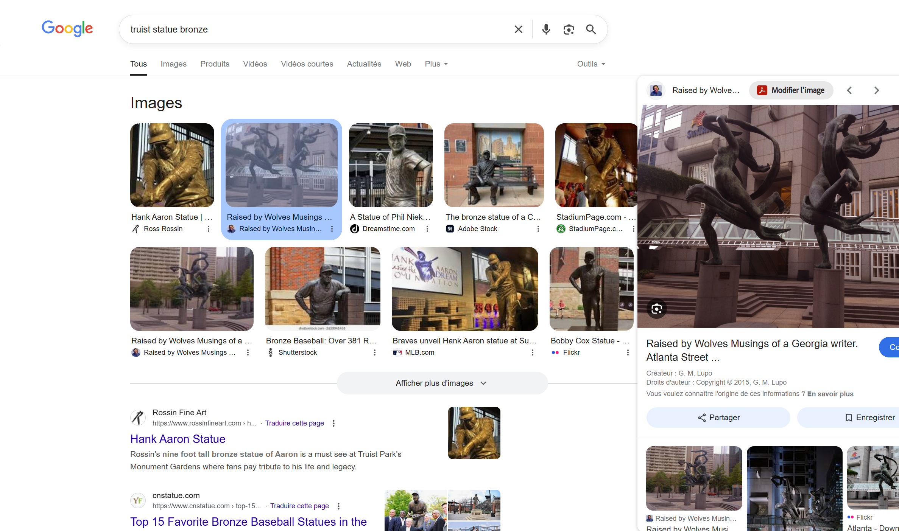

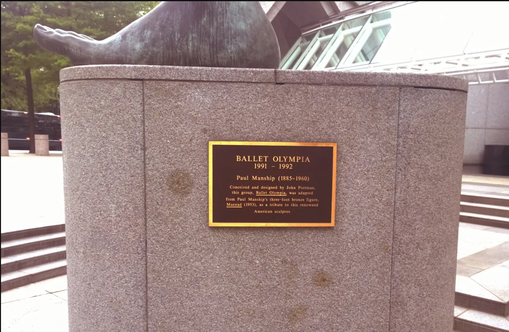

✅ **Answer:** *Ballet Olympia* and *John Portman*

---

### 🔎 Mission #4 – The Insurance Fraud Suspect

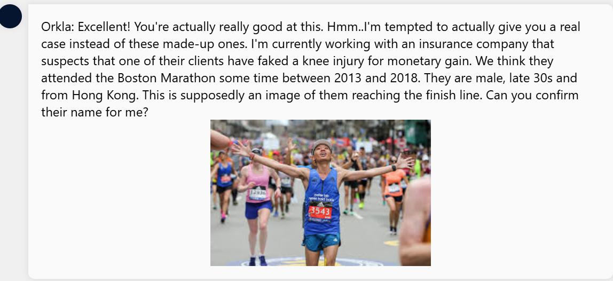

**Step 1: Information Breakdown**
Key data points:

* Event: *Boston Marathon*
* Timeframe: *2013–2018*
* Identity indicators: *Male, \~late 30s, from Hong Kong*
* Strongest lead: *Visible runner bib number in the image*

**Step 2: Using Official Records**
I accessed the [Boston Athletic Association results archive](https://www.baa.org/races/boston-marathon/results) which allows searching by bib number.

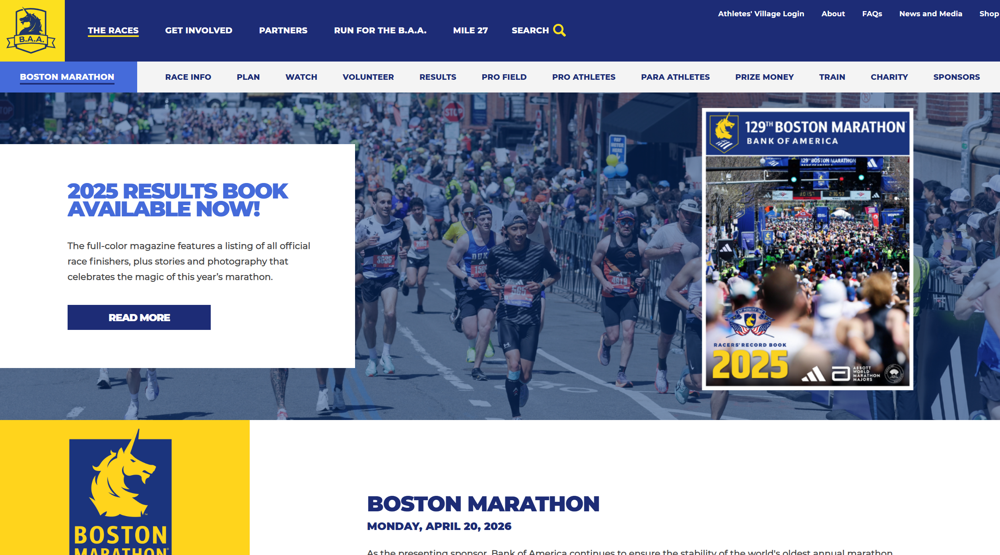
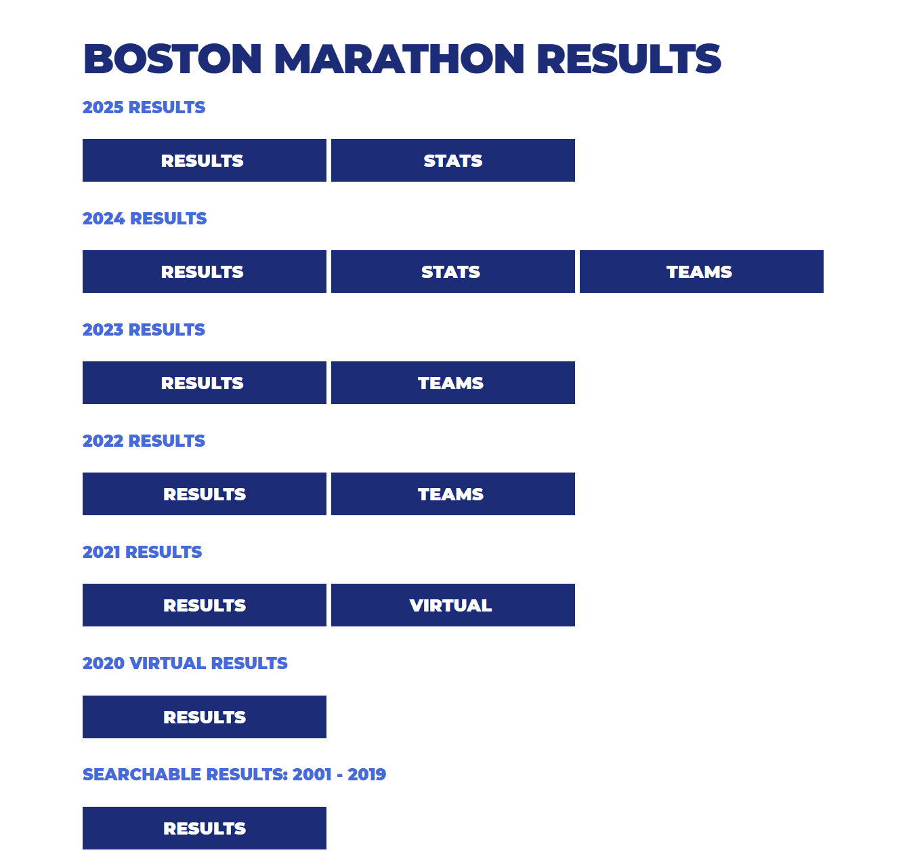
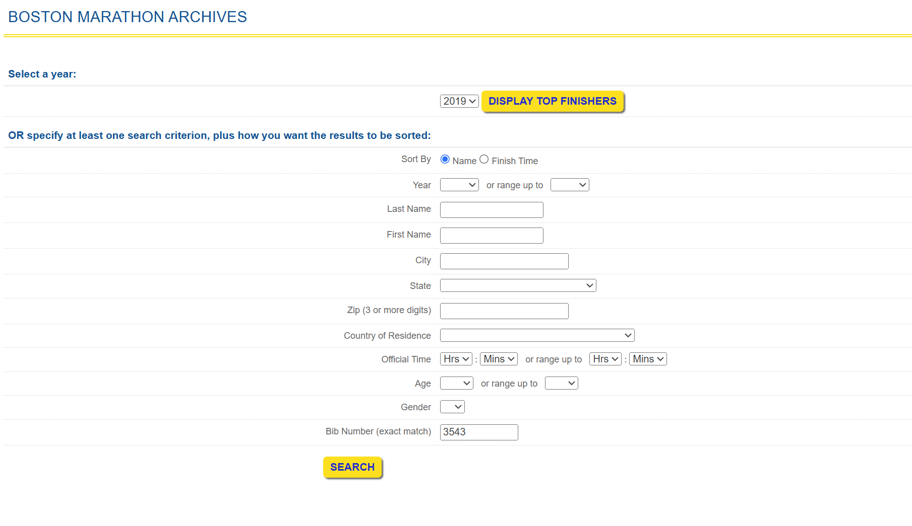

After entering the runner number into the correct year’s result page:

✅ **Answer:** *Ngai, Peter Yuen Man*

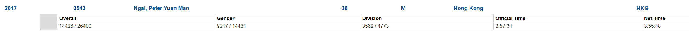

---

## 🛠️ Tools Used

* Coca-Cola Freestyle Machine Locator
* what3words Geolocation System
* Google Maps + Street View
* Boston Marathon Results Archive (BAA.org)
* Visual reasoning & behavioral context mapping
* OSINT logic and keyword-based search patterns

---

## 🧩 Skills Demonstrated

* **Geolocation Precision:** Mapping clues to real-world coordinates with high accuracy.
* **Environmental Analysis:** Extracting usable intel from street signs, events, and crowd types.
* **Public Record Intelligence:** Correlating personal details with race archives to confirm identity.
* **Technical Adaptability:** Switching between tools like Freestyle locators, mapping software, and geolocation APIs.
* **Strategic Thinking:** Connecting disparate details to form a coherent trail of evidence.
* **Creative Deduction:** Recognizing unusual data formats like what3words or interpreting cosplay as contextual evidence.

---

## 🛡️ Analyst’s Note

This evaluation reinforced the power of OSINT in diverse and unconventional contexts. It highlights how tools not originally designed for security (e.g., soda machine locators or race result databases) can be weaponized for investigation. Success in this case hinged on not only knowing where to look, but **understanding how context, behavior, and geography intersect** to form actionable intelligence.

The true challenge wasn’t just to solve puzzles — it was to think like an analyst, always assuming the next clue was hiding in plain sight.
