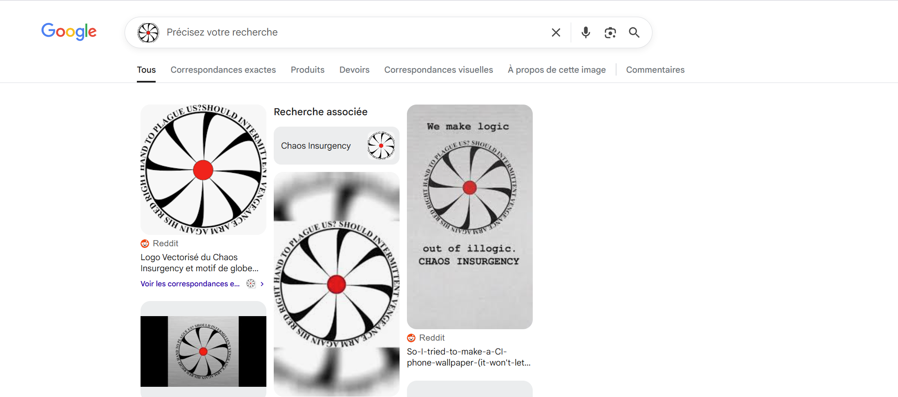
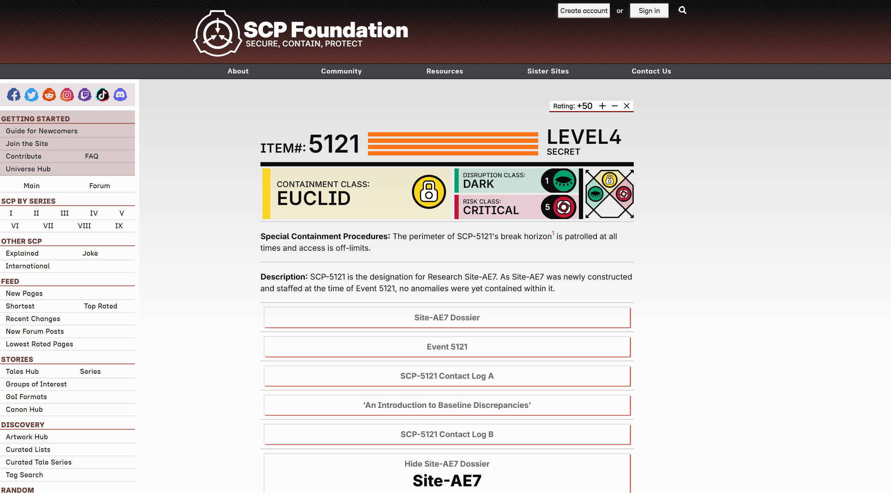
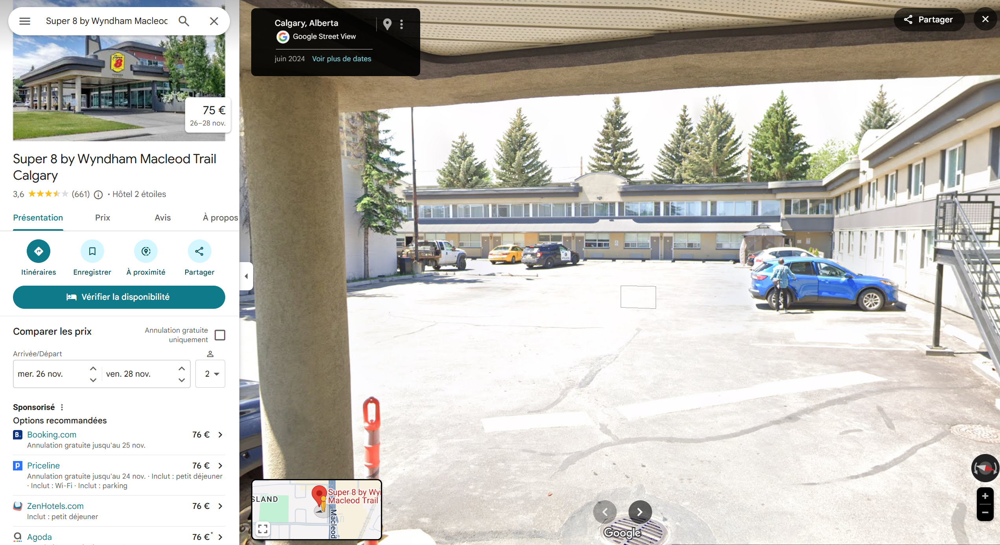
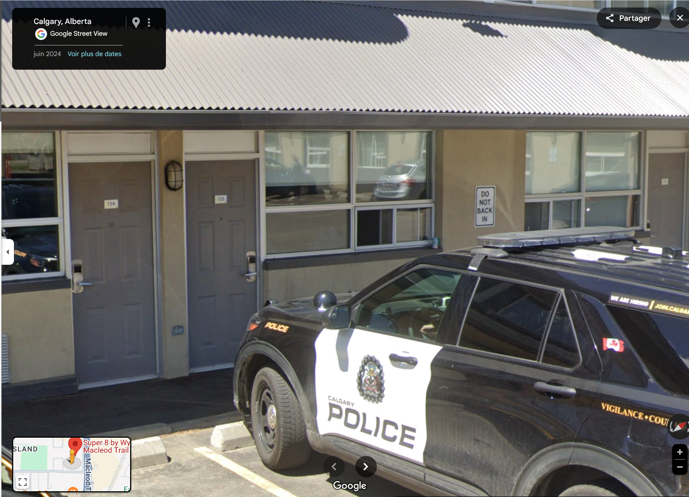
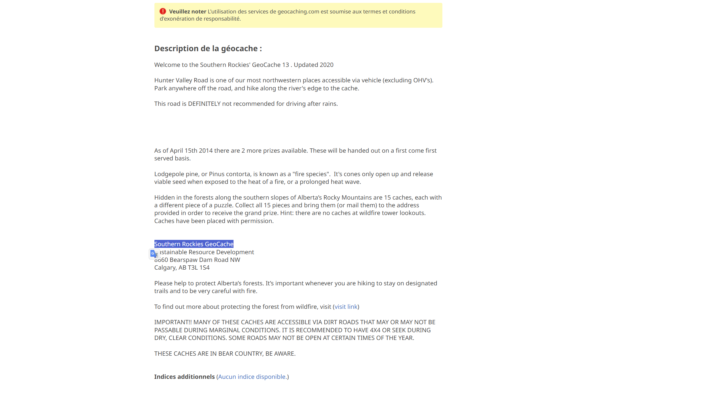
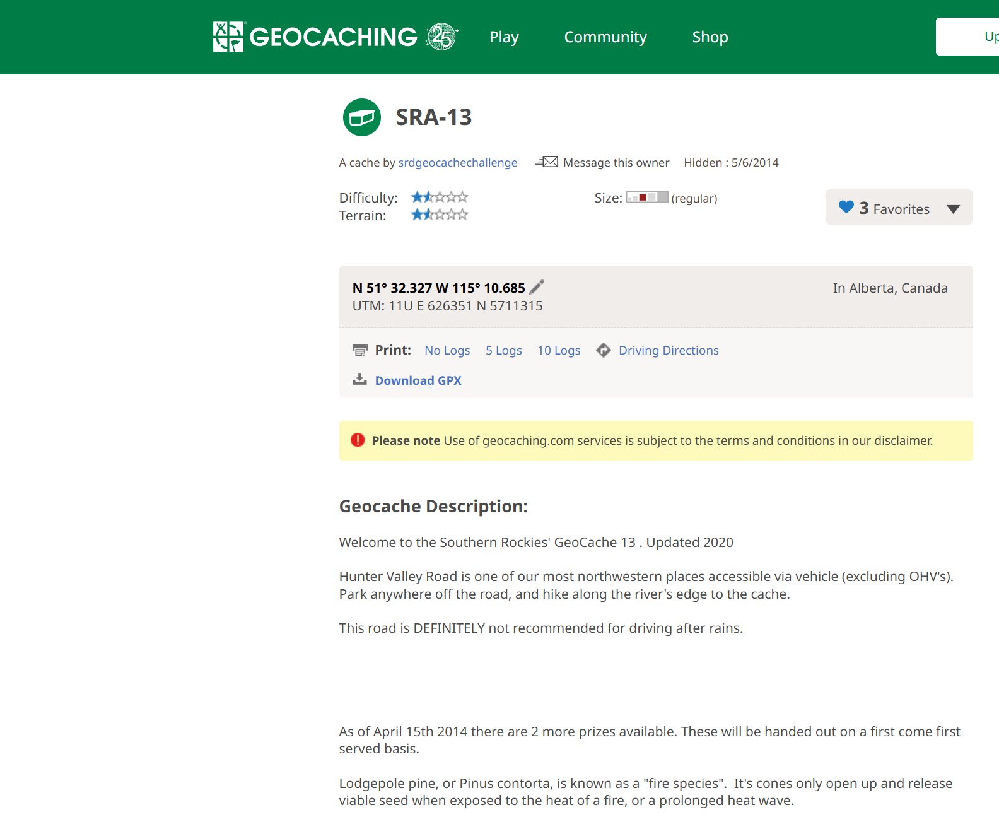
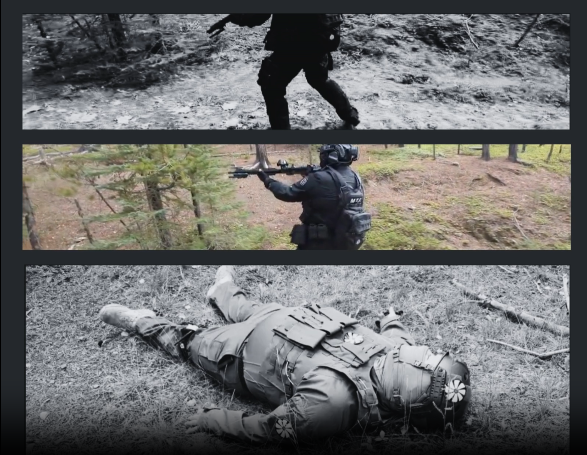

🕵️‍♀️ **OSINT Case Report — Orkla: Dragon Con Detective**

**Platform:** Kase Scenarios

**Agency:** Foundation Intelligence Agency (FIA)

**Analyst:** Kerneth

**Date:** 23/08/2025

**Mission Status:** ✅ Successfully Completed

---

### 🎯 Mission Objective

The following report documents and analyzes a critical security incident that occurred during Operation SCP: Insurgency.
According to initial intelligence, an insurgent cell successfully infiltrated a secure Foundation site, gaining access to internal servers and exfiltrating classified material. 
The operation began under the direct coordination of Dr. Sophia Rivers, a technical intelligence specialist, tasked with supporting the intervention team in tracking and analyzing the adversary’s digital footprint.

From the very beginning, it was confirmed that the insurgent already held a significant advantage, which prompted the immediate deployment of the response protocol. 
The operational team carried out insertion into hostile territory, including aerial reconnaissance, ground infiltration, and secure access to the targeted facilities.
Preliminary OSINT collection indicated that the adversary had not only anticipated parts of the defense systems but had also used compromised Foundation credentials to access critical servers and exfiltrate several highly sensitive files.
This report provides a reconstruction of the events, describing the objectives, methodology, and findings that allowed us to track the insurgent’s actions and identify their assets and movements.

---

### 🧠 Methodology

The investigation was approached using the following process:

* Visual intelligence analysis — inspection of provided images, insignia, and intercepted communications for embedded codes and identifiers.
* File exploitation — recognition and processing of technical file formats (e.g., .kml) using Google Earth to extract flight trajectory data.
* Code decryption — interpretation of phonetic alphabet references (“Hotel Oscar 192854”) and structured alphanumeric strings (e.g., GC3P4R2).
* Open-source geolocation — correlation of hotel references and unit numbers with Google Maps and other mapping platforms.
* Object recognition — identification of vehicles using AI-assisted reverse image searches and cross-validation with manufacturer databases.
* Geocache verification — analysis of online geocaching registries to resolve encoded location markers.
* Cross-referencing intelligence — linking each data point with external open databases (SCP records, public mapping resources, community archives).

Screenshots and captures were taken at each stage to document the investigative path and validate the reproducibility of findings.

---

## 🔍 Investigation & Findings

The first indicator received was a visual fragment bearing insignia directly associated with the Chaos Insurgency, immediately confirming attribution. 

This rogue group has historically targeted Foundation assets, and the match was corroborated through open-source imagery analysis.

Shortly afterward, documents labeled at the Euclid / Dark / Critical classification level were identified. The presence of such labels signaled the compromise of material of the highest sensitivity. References within the files pointed to an Alternate Researcher, assessed as either coerced or compromised during the operation.
These details were confirmed through an open-source search referencing SCP-5121, cross-validated with entries on a publicly accessible SCP database website. This step ensured that classification levels and researcher roles were consistent with archived Foundation records available in open communities.

---

Technical analysis revealed a suspicious file with the extension .kml "Flight data.kml". Validation confirmed it as a mapping file designed for use in Google Earth. Once loaded, the file displayed the trajectory of an aircraft linked to the adversary, which passed directly over Edzell before completing its landing. This provided the first concrete trace of insurgent movements.

Further ground-level intelligence became available with the recovery of a vehicle image near the exfiltration point. Processed via open-source AI recognition tools, the vehicle was positively identified as a Volkswagen Tiguan, a detail which allowed correlation with road access routes and potential insurgent logistics.

---

An intercepted communication offered the next lead:

“Heading to Hotel Oscar 192854 ASAP. Awaiting further instructions on arrival.”

The use of the NATO phonetic alphabet indicated that “Hotel Oscar” stood for HO 192854. Once transcribed, the string was submitted to targeted open-source searches. Initial queries combining “HO 192854” with hotel references quickly returned results pointing toward a commercial establishment in Calgary. Cross-checking across multiple mapping platforms confirmed that the code referred to the Super 8 by Wyndham Trail, Calgary.

Further geolocation through Google Maps allowed investigators to isolate the exact Unit 133, validating the site as a likely safehouse or rendezvous point for insurgent operatives. This step relied entirely on open internet sources, demonstrating how coded designations embedded in adversary communications could be resolved through systematic OSINT techniques.

---

Finally, investigators encountered a code string, GC3P4R2. 

Open-source research quickly confirmed that this was a Geocaching reference code. Submitting the string into public Geocaching registries returned a direct hit: the Southern Rockies GeoCache.

The official Geocaching entry provided not only the name but also the precise GPS coordinates: 51°08′47.6″N 114°15′29.0″W. Mapping these coordinates on Google Earth placed the cache site along a known exfiltration corridor, consistent with the previously identified flight path and safehouse locations.

Thanks to the timely identification of this location, the target site was pinpointed and neutralized before further exfiltration could occur. The insurgent marker was removed, cutting off one of the adversary’s operational routes. This success confirmed the effectiveness of systematic OSINT exploitation in achieving actionable intelligence. Mission accomplished.

---

### 🛠️ Tools Used

* **Google Earth** (for processing `.kml` flight trajectory files)
* **Google Maps + Street View** (hotel unit identification, route validation)
* **Geocaching Database** (resolving GC3P4R2 reference and extracting GPS coordinates)
* **Reverse Image Search + AI Vehicle Recognition** (identifying the Volkswagen Tiguan)
* **SCP Archives (community databases)** (confirming classification levels and researcher references such as SCP-5121)
* **Open-source keyword queries** (interpreting coded messages like “Hotel Oscar 192854” through phonetic alphabet + mapping correlation)

---

### 🧩 Skills Demonstrated

* **File Exploitation & Technical Analysis** — processing unusual formats (`.kml`) and extracting actionable movement data.
* **Geospatial Intelligence (GEOINT)** — converting codes and file outputs into real-world coordinates, validating safehouses and exfiltration routes.
* **Codebreaking & Decryption** — interpreting NATO phonetic alphabet references and hidden alphanumeric codes.
* **Object Recognition** — leveraging OSINT tools to identify vehicles from partial visual evidence.
* **Cross-referencing Open Databases** — validating SCP classifications and personnel roles via publicly accessible archives.
* **Operational Reasoning** — linking fragmented intelligence into a continuous narrative of insurgent movements.

---

### 🛡️ Analyst’s Note

This case study illustrates how **structured OSINT methodology** can dismantle complex insurgent activity by turning scattered, coded fragments into a coherent operational picture.

What began as vague references — a file extension, a code string, an intercepted message — evolved into a complete intelligence chain: from hostile attribution (**Chaos Insurgency**) to classified data compromised (**Euclid / Dark / Critical**) to the physical coordinates of an exfiltration cache in the **Southern Rockies**.

The strength of the investigation was not only in finding answers, but in demonstrating how **publicly accessible platforms** (Google Earth, Geocaching, community SCP databases) can be exploited as tools of intelligence. This reinforces a key OSINT principle: **seemingly benign public data, when cross-referenced creatively, can expose critical adversary operations**.

The mission’s success was secured by treating every clue — from a phonetic code to a GPS marker — as a lead worth pursuing. In the end, the adversary’s network was traced, their assets identified, and their operational marker neutralized. **Mission accomplished.**
